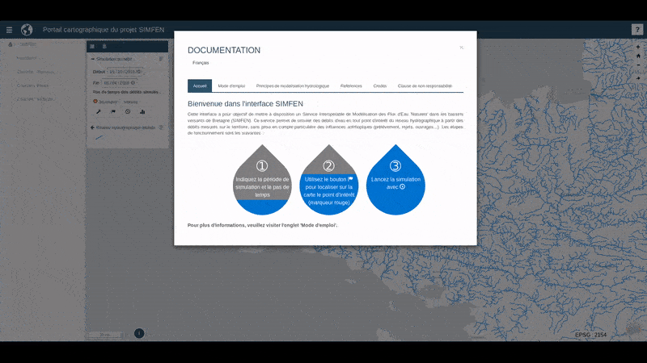
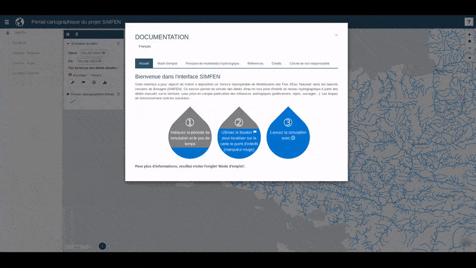

# Interface web du projet SIMFEN

## Description

Dans le cadre de l'Appel à Manifestation d'Intérêt pour l'acquisition et le partage de connaissances dans le domaine de la gestion intégrée de l'eau, l'Agrocampus Ouest a déposé un projet de Service Interopérable de Modélisation des Flux d'Eau 'Naturels' (SIMFEN) dans les bassins versants de Bretagne. Ce projet s'effectue en partenariat avec l'IRSTEA Antony, GéoBretagne, le pôle métier "EAU" de GéoBretagne et l'Observatoire de l'Eau en Bretagne.

Pour permettre de simuler ces flux d'eau facilement, une interface web a été produite en prenant comme base le visualiseur [MViewer](https://github.com/geobretagne/mviewer) de GéoBretagne. Un add-on pour indiquer, envoyer, récupérer, visualiser et télécharger les simulations a été développée et intégré à ce visualiseur. L'ensemble des étapes pour alimenter et exécuter le service web à partir de l'interface web ont été développées pour être les plus intuitives possible pour permettre à tous et à toutes d'effectuer des simulations de flux d'eau sans compétences informatiques et hydrologiques.

Ainsi, cette interface est composée :

- d'une liste de couches / fonctions
- d'une carte
- d'un panneau de renseignements
- d'un panneau de résultats

Cette forge github contient cet add-on exclusivement, l'ensemble des scripts du service OGC WPS (PyWPS, modélisation, etc...) se trouvent sur une forge privée.

Voici le lien permettant d'accéder à cette interface web : [Portail web SIMFEN](http://bit.do/simfen)

Un wiki contenant plus d'informations à propos de ce projet (interface, service WPS, procédure d'installation, etc...) est disponible.

# Sommaire

* [Description](#description)
* [Installation](#installation)
* [Utilisation](#utilisation)
* [Crédits](#crédits)
* [Licence](#licence)
* [Todo](#todo)

# Installation

Pour installer l'add-on connecté au service web SIMFEN, il est nécessaire de disposer des éléments suivants :

- **le service web SIMFEN actif et accessible**
- un MViewer
- l'add-on
- un serveur web

Ensuite, il faut suivre la démarche suivante :

1. Placer le MViewer sur le serveur web et rendre celui-ci accessible via internet.
2. En termes de bonnes pratiques, créer un dossier "apps" dans le même dossier où est placé le MViewer, puis créer un dossier dans celui-ci et placer l'add-on dedans. Ainsi, pour accéder au fichier simfen.xml contenant la configuration du MViewer pour cet add-on, l'url sera la suivante : ```http://serveur.fr/mviewer/?config=/apps/simfen/simfen.xml```. Sinon, placez directement les fichiers de l'add-on dans les dossiers ayant les mêmes noms du dossier MViewer.
3. Dans le fichier [__simfen_help.xml__](simfen_help.xml) remplacez le path situé à la ligne 3 ```<!ENTITY path "/apps/simfen">``` par celui que vous avez défini selon le nom de vos répertoires. Cela permet d'indiquer au MViewer, situé dans un autre répertoire, où trouver les fichiers indiqués. Sinon, il cherchera à la racine de celui-ci directement (ce qui n'est pas gênant si vous n'avez pas créé le dossier "apps").
4. Dans le fichier [__waterFlowSimulation.js__](customcontrols/waterFlowSimulation.js) remplacez la valeur du service web vers lequel vous souhaitez pointer à la ligne 14 : ```var _urlWPS = "http://wps.geosas.fr/simfen?";```.

De là, il ne vous reste plus qu'à vous connecter à l'interface web à partir de votre navigateur.

# Utilisation

Voici une démonstration de la simulation d'un débit en mode automatique, c'est à dire réaliser ces étapes :

- indiquer la période et le pas de temps de la simulation
- indiquer l'endroit où simuler le débit
- lancer la simulation du débit

L'utilisateur obtient alors une liste de fichier à télécharger dont un avec les débits simulés et un graphique représentant cette simulation. Il est possible d'afficher les débits mesurés aux stations qui ont été employées pour alimenter la modèle pour vérifier la simulation (ex : des valeurs extrêmes qui peuvent trouver leur cause via une station de mesure ayant eu un fort orage).



Voici une démonstration de la simulation d'un débit en mode avancé où l'utilisateur va indiquer quelles stations employer, c'est-à-dire réaliser ces étapes :

- indiquer la période et le pas de temps de la simulation
- nommer la simulation (pour nommer les fichiers à télécharger)
- indiquer l'endroit où simuler le débit
- afficher les stations disponibles à proximité
- sélectionner les stations à employer (au plus 5)
- lancer la simulation du débit

L'utilisateur obtient alors une liste de fichier à télécharger dont un avec les débits simulés et un graphique représentant cette simulation. Il est possible d'afficher les débits mesurés aux stations qui ont été employées pour alimenter la modèle pour vérifier la simulation (ex : des valeurs extrèmes qui peuvent trouver leur cause via une station de mesure ayant eu un fort orage).



# Crédits

Add-on développé par [Donatien Dallery](http://dalleryd.fr) pour le [MViewer](http://github.com/geobretagne/mviewer) dans le cadre du projet SIMFEN.

# Licence

GNU General Public License v3.0

[](https://creativecommons.org/licenses/by-sa/4.0/)

# Powered by

<a href="http://www.agrocampus-ouest.fr"></a>

# TODO

- Countdown variable selon la fonction employée (nécessite des tests pour déterminer la f(x) = ax + b selon la surface du bassin cible et la période de simulation);
- Ajouter un voyant/message indiquant si le service web est fonctionnel ou non (serveur de calcul down/maintenance);
- Développer la fonction permettant de simuler les débits rentrant dans une baie (sélection de tous les exutoires à la baie, simulation pour chacun des points, somme des débits simulés). Ce traitement peut être très rapide étant donné que les exutoires à la baie seraient précalculés/défini et donc, leurs bassins versants déjà produits. Concernant la simulation des débits, la convolution pour chacun de ces points peut être précalculée à la manière des inversions pour les stations sources. Cependant, les stations sources pour chacun de ces exutoires seraient définies automatiquement, ne laissant pas la possibilité aux utilisateurs de définir les stations sources à employer pour chacun des exutoires de la baie. De ce fait, une utilisation automatique et rapide pourrait être faite directement via l'interface avec des débits simulés précalculé et stocké de la même manière que les inversions. Et si l'utilisateur veut définir lui-même les stations sources, alors il utilise la fonction "simulation du débit" pour chacun des exutoires cibles et somme lui-même les débits entrant dans la baie.
- Information à propos de la place dans la file d'attente de l'utilisateur (nécessite de faire une fonction pour interroger la base de données contenant la table pywps_stored_requests pour déterminer la place de l'utilisateur, le nombre de requêtes en attentes et suivre l'évolution de cette file). Cette file peut se faire de deux façons : la première un process qui va récupérer l'uuid du process de l'utilisateur, le chercher dans la table pywps_stored_requests, regarder sa date de mise en attente, comparer avec toutes les autres et mettre à jour cela toutes les n secondes et l'indiquer à l'utilisateur. La seconde méthode est de modifier PyWPS directement en ajoutant un attribut "queuePlace" dans l'enregistrement dans la table pywps_stored_requests et mettre à jour cette place au fur et à mesure des entrées/libérations. De cette manière, cet ajout peut être partagé avec la communauté PyWPS, voir créer une fonction par défaut à la façon de response_update() qui serait mise à jour lors d'un état ProcessStarted queuePlace="place" pour basculer ensuite sur un ProcessAccepted percentCompleted="%".
- Développer une interface administrateur pour les fonctions permettant d'interagir avec la base de données (vider les tables, forcer une inversion ou la supprimer), générer un bassin versant source, etc...

[//]: # (These are referenced links used in the body of this note and get stripped out when the markdown processor does its job. There is no need to format nicely because it shouldn't be seen.)
